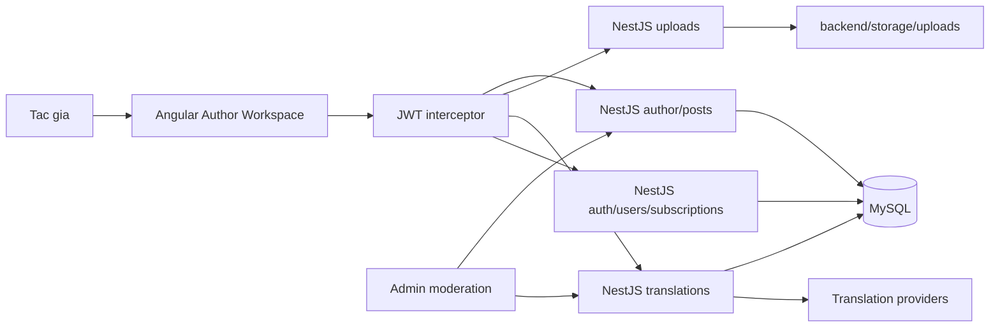
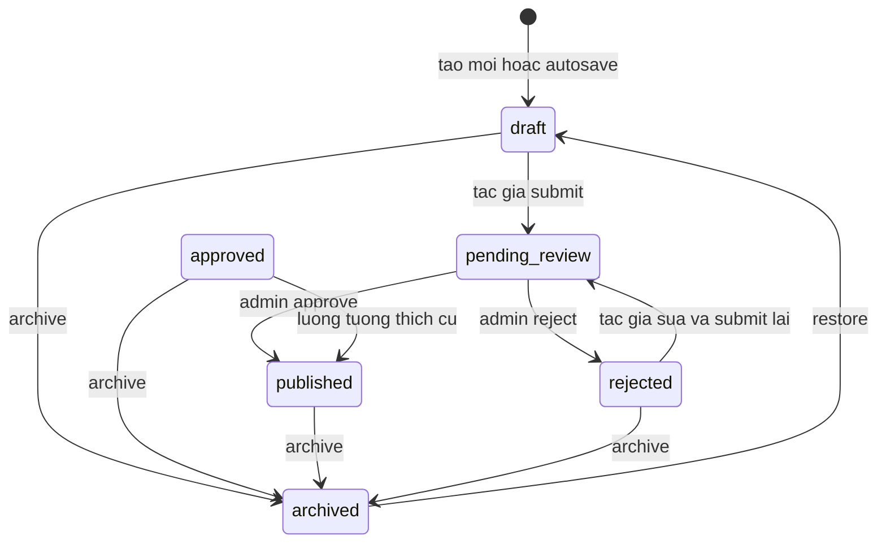

# PHAN C - AUTHOR WORKSPACE, TRANSLATION VA PROFILE

Tai lieu nay mo ta phan C theo **code hien tai cua nhanh `C`**, khong mo ta theo ban prototype cu.
Prototype trong `prototype/` chi la tai lieu doi chieu giao dien va khong duoc sua khi phat trien Angular.

- Workspace: `D:\Lingora`
- Backend: NestJS + Sequelize + MySQL trong `backend/`
- Frontend: Angular trong `frontend/`
- API prefix mac dinh: `/api/v1`
- Frontend development: `http://localhost:4200`
- Backend development: `http://localhost:3000`
- Ngay doi chieu code: 2026-08-01

## 1. Pham vi phan C

Phan C truc tiep phu trach cac luong danh cho tac gia:

1. Tao va sua bai viet bang rich-text editor.
2. Tu dong luu bai viet vao localStorage va backend.
3. Upload anh, audio va video vao noi dung bai viet.
4. Chon ngon ngu goc va cac ngon ngu dich.
5. Preview bai goc hoac ban dich truoc khi gui.
6. Gui bai sang trang thai cho duyet.
7. Quan ly bai viet tai My Articles: loc, tim kiem, phan trang, chon hang loat, thung rac.
8. Xem bai viet cua tac gia va bai da public.
9. Quan ly translation target, status matrix va translation worker.
10. Xem va chinh sua profile, avatar, mau accent, mau nen profile, doi mat khau.
11. Xem profile nguoi khac, followers, following va bai public cua ho.

Nhung thanh phan dung chung ma phan C su dung hoac co bo sung de cac luong tren hoat dong:

- JWT authentication va role guard.
- Main layout, sidebar, locale selector va theme toggle.
- Toast thong bao dung chung.
- Pagination dung chung.
- Public post API, public user API va subscription API.

Phan admin khong phai giao dien chinh cua C. Tuy nhien, thao tac admin approve/reject la dau noi bat buoc cua luong bai viet va dich, nen duoc mo ta trong tai lieu nay.

## 2. So do tong quan



## 3. Luong trang thai bai viet

Trang thai duoc khai bao tai `backend/src/modules/posts/posts.constants.ts`.



Thung rac khong phai mot gia tri trong `status`. Bai trong thung rac duoc danh dau bang `posts.deleted_at`:

- Move to trash: gan `deleted_at`.
- Restore from trash: xoa `deleted_at`.
- Delete permanently: chi cho phep khi `deleted_at` dang co gia tri.
- Delete draft trong editor: xoa vinh vien bai `draft/rejected` da duoc server autosave.

Code hien tai cho phep tac gia sua cac trang thai `draft`, `pending_review`, `rejected`. Day la mot diem can chu y khi admin co the approve cung luc tac gia dang sua; xem muc **16. Gioi han va viec con lai**.

## 4. Luong Create Post

### 4.1. Mo editor

- Tao moi: `/workspace/create`.
- Sua bai: `/workspace/posts/:id/edit`.
- Route duoc bao ve boi `authGuard` trong `frontend/src/app/app.routes.ts`.
- Component chinh: `frontend/src/app/features/workspace/post-editor.component.ts`.
- Template: `post-editor.component.html`.
- CSS rieng: `post-editor.component.scss` va `post-editor.global.scss`.

Khi tao moi:

1. Frontend goi `GET /posts/options` de lay categories va languages.
2. Category dau tien duoc chon neu chua co du lieu khoi phuc.
3. Ngon ngu goc duoc dong bo theo locale hien tai neu locale do ton tai trong danh sach ngon ngu backend.
4. Frontend thu khoi phuc snapshot trong localStorage truoc khi tao mot draft moi.

### 4.2. Gioi han noi dung

Ca frontend va backend cung kiem tra:

- Title toi da 20 tu va toi da 255 ky tu theo DTO.
- Content toi da 3000 tu.
- Save/submit thong thuong bat buoc co title va content co y nghia.
- Autosave cho phep chi co title hoac chi co content.

Backend kiem tra tai:

- `AuthorPostsService.assertEditorContentLimits()`.
- `AuthorPostsService.assertAutosaveContentLimits()`.

### 4.3. Rich-text editor

Editor hien tai ho tro:

- Undo/redo.
- Normal text va heading.
- Bold, italic, strike-through.
- Inline code va code block.
- Text color va highlight.
- Link.
- Anh, audio, video.
- Bullet list, numbered list va alignment.
- Preview mobile/desktop.

HTML truoc khi luu duoc backend sanitize. Cac tag media nhu `img`, `audio`, `video`, `source`, code block va mot so class editor duoc giu lai; toolbar, nut xoa va menu chi dung khi edit bi loai bo.

### 4.4. Autosave

Autosave co hai lop:

1. **Local snapshot**: sau khoang 500 ms ke tu thay doi, du lieu duoc luu vao localStorage.
2. **Server autosave**: sau mot khoang tre rieng, frontend goi API tao/cap nhat draft.

Khi dong tab hoac reload:

- `beforeunload` va `pagehide` goi request `fetch(..., { keepalive: true })` neu co thay doi chua gui.
- Neu keepalive that bai, localStorage van la nguon khoi phuc.
- Draft moi sau khi duoc backend tao se doi URL bang `Location.replaceState()` sang `/workspace/posts/:id/edit` ma khong reload trang.

API:

- `POST /author/posts/autosave`: tao draft tu dong lan dau.
- `PATCH /author/posts/:id/autosave`: cap nhat draft/rejected.

Backend khong autosave bai `pending_review`, `approved`, `published` hoac `archived`.

### 4.5. Save draft va submit

Save draft:

1. Dong bo HTML tu `contenteditable` vao model Angular.
2. Tao moi bang `POST /author/posts`, hoac cap nhat bang `PATCH /author/posts/:id`.
3. Neu la draft moi, URL duoc doi thanh route edit.
4. Toast hien thi tai vi tri thong bao dung chung.

Submit:

1. Luu/cap nhat noi dung truoc.
2. Goi `POST /author/posts/:id/submit` neu bai chua o `pending_review`.
3. Backend chuyen `draft` hoac `rejected` sang `pending_review`.
4. Frontend xoa snapshot autosave va dieu huong ve My Articles.

### 4.6. Admin duyet va khoi tao dich

Phan admin la dau noi cua luong C:

- `PATCH /admin/posts/:id/review` voi `decision=approve` chuyen bai sang `published`.
- Cac translation target chua completed duoc chuyen sang `queued`.
- `decision=reject` chuyen bai sang `rejected` va dat target ve `not_started`.
- Reject bat buoc co review note.

## 5. Luong upload anh, audio va video

Frontend dung `frontend/src/app/features/workspace/services/editor-uploads.service.ts`.

| Loai | Endpoint | Form-data key | Gioi han |
|---|---|---|---:|
| Anh | `POST /uploads/editor-image` | `image` | 5 MB |
| Audio | `POST /uploads/editor-audio` | `audio` | 25 MB |
| Video | `POST /uploads/editor-video` | `video` | 100 MB |
| Media tong quat | `POST /uploads/editor-media` | `media` | 100 MB |

Tat ca endpoint upload yeu cau `Authorization: Bearer <access_token>`.

Backend:

1. Multer doc file vao memory.
2. `UploadsService` kiem tra MIME type, kich thuoc va magic bytes that cua file.
3. File duoc dat ten bang UUID.
4. File duoc ghi vao `backend/storage/uploads`.
5. API tra ve URL dang `/uploads/<filename>`.
6. `main.ts` public thu muc upload tai prefix `/uploads/`.

Cloudinary da duoc go bo theo yeu cau rollback. Code hien tai luu media tren filesystem local, khong luu cloud.

## 6. Luong translation

### 6.1. Translation target va matrix

Moi ban dich la mot dong trong `post_translations` va duoc xac dinh boi cap:

- `post_id`
- `language_id`

Ban nguon:

- Co `language_id = posts.original_language_id`.
- Chua title, slug va content tac gia nhap.
- Luon co `translation_status = completed`.
- `translation_provider = null`.

Ban dich dich:

- Duoc tao voi title/content/slug rong.
- Bat dau bang `not_started`.
- Khi admin approve hoac API queue duoc goi thi chuyen `queued`.

Khi tac gia sua title/content nguon, cac target khac ngon ngu goc duoc dua ve `not_started`, provider bi xoa de tranh hien thi ban dich cu.

Status matrix dung chung cho My Articles va Admin:

- `not_started`
- `queued`
- `processing`
- `completed`
- `failed`

### 6.2. Preview ban dich

Preview khong bat buoc luu vao database:

1. Neu preview ngon ngu goc, frontend dung truc tiep draft hien tai.
2. Neu target da `completed` va co noi dung, frontend dung ban da luu.
3. Neu chua co ban da luu, frontend goi `POST /translations/preview`.
4. Provider dich title va content, sau do preview render ket qua.

Preview truoc khi publish chi la xem thu. No khong tu dong thay the target trong DB.

### 6.3. Translation worker

Worker nam trong `TranslationsService` va chay trong process NestJS:

1. Khi module khoi dong, `recoverStaleJobs()` dua job `processing` bi tre qua nguong ve `queued`.
2. Neu `TRANSLATION_WORKER_ENABLED=true`, timer chay theo `TRANSLATION_WORKER_INTERVAL_MS`.
3. Worker tim target `queued` cu nhat.
4. Transaction dung row lock va `skipLocked` de hai worker khong claim cung mot target.
5. Target duoc chuyen sang `processing` truoc khi goi provider.
6. Provider duoc thu theo `TRANSLATION_PROVIDER_ORDER`.
7. Thanh cong: luu title, slug, content, provider va `completed`.
8. Het provider ma van that bai: target thanh `failed`.

Noi dung dai duoc chia theo text/HTML segment va gom batch truoc khi goi provider. HTML tag duoc giu, chi text node duoc dich.

### 6.4. Provider hien co

| Ten config | Provider | Bien moi truong chinh |
|---|---|---|
| `deepl` | DeepL API | `DEEPL_API_KEY`, `DEEPL_API_URL` |
| `azure` | Azure Translator | `AZURE_TRANSLATOR_KEY`, `AZURE_TRANSLATOR_REGION`, `AZURE_TRANSLATOR_ENDPOINT` |
| `google-cloud` | Google Cloud Translation v2 | `GOOGLE_CLOUD_TRANSLATION_API_KEY`, `GOOGLE_CLOUD_TRANSLATION_URL` |
| `google-free` | Google public translate endpoint | `GOOGLE_FREE_ENABLED`, `GOOGLE_FREE_MAX_TEXT_LENGTH` |
| `libretranslate` | LibreTranslate | `LIBRETRANSLATE_URL`, `LIBRETRANSLATE_API_KEY` |
| `mock`, `mock-fail`, `mock-rate-limit`, `mock-timeout` | Test provider | Khong dung production |

Thu tu mac dinh trong `.env.example`:

```env
TRANSLATION_PROVIDER_ORDER=deepl,azure,google-cloud,google-free
```

Provider khong co key se tra failed va worker tiep tuc provider sau. Tuyet doi khong commit API key vao Git; chi dien trong `backend/.env`.

### 6.5. Diem chua hoan tat cua C-08

Migration `20260724100000-drop-translation-attempts.cjs` da xoa bang `translation_attempts`.
Vi vay code hien tai:

- Co fallback provider.
- Co lock tranh hai worker xu ly trung.
- Co stale-job recovery sau restart.
- Co chia nho noi dung dai.
- **Chua luu lich su tung attempt vao DB**.
- `GET /translations/:id/attempts` hien tra `[]`.

Neu yeu cau C-08 van bat buoc day du, can khoi phuc model/table `translation_attempts` va ghi provider, thu tu, status, loi, so ky tu, started/finished cho moi lan goi.

## 7. Luong My Articles

Route: `/workspace/posts`.

Component: `frontend/src/app/features/workspace/my-posts.component.*`.

Chuc nang:

- Tab All, Draft, Pending, Published va Trash.
- Tim kiem realtime bang RxJS `Subject` va debounce.
- Loc theo ngon ngu va category.
- Phan trang server-side, mac dinh 10 item/trang.
- Hien status matrix va menu `+N` de xem cac ngon ngu con lai.
- Xem bai, sua bai, submit, archive, restore, move to trash.
- Restore tu trash va delete permanently.
- Chon hang loat, bao gom lay ID qua nhieu trang khi chon tat ca.
- Dialog xac nhan rieng cho move-to-trash va delete permanently.
- Luu filter/page/search tren query string de nut Back quay lai dung danh sach.

Quy tac action trong thung rac:

- Co xem.
- Co restore.
- Co xoa vinh vien.
- Khong co sua.

Quy tac link xem:

- Bai public (`approved`/`published`) di den `/post/:id`.
- Bai khong public hoac trong trash di den `/workspace/posts/:id/view`.
- Trang author preview co the nhan query `trash=true`.

Pagination dung component chung `frontend/src/app/shared/components/pagination/pagination.component.ts` voi dang:

```text
1 ... trang-truoc trang-hien-tai trang-sau ... trang-cuoi
```

## 8. Luong xem bai va fallback ngon ngu

Route public:

- `/post/:id`
- `/posts/:id`

Route author preview:

- `/workspace/posts/:id/view`

Frontend chon ban dich theo thu tu tai `getPostTranslation()`:

1. Ban trung locale UI hien tai.
2. Ban trung ngon ngu goc cua bai.
3. Ban completed dau tien con noi dung.

Nho fallback nay, bai viet bang tieng Viet van xem duoc khi UI dang tieng Anh, ke ca khi target tieng Anh chua dich xong.

`post-detail-html.util.ts` chuan hoa HTML code block, line number va media khi render. Noi dung co chu dai hoac code dai duoc gioi han trong container va dung horizontal scroll thay vi tran layout.

Public API chi tra bai co trang thai `approved` hoac `published`, chua bi xoa. Trang thai `approved` cu duoc map thanh `published` trong contract public de tuong thich du lieu cu.

## 9. Luong Profile

### 9.1. Route

- Profile cua minh: `/profile`, can dang nhap.
- Profile nguoi khac: `/profile/:id`, co the xem public.

`ProfileComponent` doc `:id` de phan biet profile cua minh va nguoi khac. Link avatar/ten o feed, tooltip va danh sach goi dung `/profile/:id`, khong dua tat ca ve profile cua tai khoan dang nhap.

### 9.2. Chuc nang profile cua minh

- Sua display name, username va bio.
- Upload avatar.
- Crop avatar hinh vuong 512 x 512 truoc khi upload; giao dien hien thi avatar bang hinh tron.
- Chon accent color.
- Chon background color rieng cua profile.
- Tu dong chon mau chu tuong phan dua tren do sang mau.
- Mo menu ba cham va doi mat khau.
- Doi mat khau thanh cong se xoa session va chuyen ve login.
- Xem modal followers/following va tim kiem trong danh sach.
- Hien danh sach bai public cua nguoi dung, tai them bang IntersectionObserver.

Avatar profile dung lai upload image endpoint, sau do luu URL bang `PATCH /auth/me`.

### 9.3. Branding

- Accent duoc luu trong `users.accent_color`.
- Background profile duoc luu trong `users.background_color`.
- Accent cua profile cua minh duoc persist vao localStorage va ap dung cho cac nut/accent chung cua web.
- Khi xem profile nguoi khac, accent va background cua ho chi ap dung tam thoi cho trang profile; roi trang se khoi phuc branding cua nguoi dang nhap.
- Background color chi doi profile/main layout cua trang profile, khong doi cac trang khac.

### 9.4. Profile nguoi khac

`GET /users/:id` tra:

- Ten, handle, bio, avatar.
- Accent/background.
- Role.
- So follower/following.
- So bai public.
- Trang thai nguoi xem co dang follow hay khong.

Followers/following cua profile nguoi khac dung:

- `GET /users/:id/followers`
- `GET /users/:id/following`

Follow/unfollow dung:

- `POST /subscriptions/:authorId`
- `DELETE /subscriptions/:authorId`

## 10. JWT va phan quyen lien quan

Frontend gui token bang:

```http
Authorization: Bearer <access_token>
```

`authInterceptor`:

1. Gan access token cho request private.
2. Neu gap 401 va co refresh token, goi refresh mot lan.
3. Gui lai request voi access token moi.
4. Neu refresh that bai, xoa session va mo auth modal.

Backend:

- `JwtStrategy` doc Bearer token va kiem tra user con `active`.
- `JwtAuthGuard` bao ve author posts, uploads, translations private va profile update.
- `@CurrentUser()` lay user dang dang nhap tu request.
- `RolesGuard` + `@Roles('admin')` bao ve worker run-once, metrics va admin API.

## 11. API phan C

Tat ca URL duoi day nam sau prefix `/api/v1`.

### 11.1. Author posts

| Method | Endpoint | Tac dung |
|---|---|---|
| `POST` | `/author/posts` | Tao draft day du |
| `POST` | `/author/posts/autosave` | Autosave va tao draft moi |
| `GET` | `/author/posts` | Danh sach, filter, search, pagination, trash |
| `GET` | `/author/posts/options/filters` | Category/language filter cua tac gia |
| `GET` | `/author/posts/:id` | Lay bai cua tac gia |
| `PATCH` | `/author/posts/:id` | Sua bai |
| `PATCH` | `/author/posts/:id/autosave` | Autosave bai da co |
| `POST` | `/author/posts/:id/submit` | Gui duyet |
| `POST` | `/author/posts/:id/archive` | Archive |
| `POST` | `/author/posts/:id/restore` | Archived ve draft |
| `POST` | `/author/posts/:id/trash` | Dua vao thung rac |
| `POST` | `/author/posts/:id/restore-trash` | Khoi phuc tu thung rac |
| `DELETE` | `/author/posts/:id/draft` | Xoa draft/rejected dang soan va huy autosave |
| `DELETE` | `/author/posts/:id` | Xoa vinh vien bai trong trash |
| `GET` | `/author/posts/:id/preview` | Xem bai private cua tac gia |

Query cua danh sach:

- `status=all|public|draft|pending_review|approved|rejected|published|archived`
- `search=<text>`
- `trash=true|false`
- `categoryId=<id>`
- `originalLanguageId=<id>`
- `updatedMonth=YYYY-MM` (backend van ho tro, UI da bo filter ngay)
- `page=<n>`
- `limit=<1..50>`

### 11.2. Translation

| Method | Endpoint | Tac dung |
|---|---|---|
| `GET` | `/translations/posts/:postId/matrix` | Lay status matrix |
| `GET` | `/translations/posts/:postId/preview/:languageId` | Lay target da luu |
| `POST` | `/translations/preview` | Dich xem thu, khong luu target |
| `POST` | `/translations/queue` | Dua target vao queue |
| `POST` | `/translations/retry` | Retry target failed |
| `GET` | `/translations/:id/attempts` | Hien tra rong; xem muc gioi han |
| `POST` | `/translations/worker/run-once` | Admin chay mot job |
| `GET` | `/translations/metrics` | Admin xem tong theo status |

### 11.3. Upload

| Method | Endpoint | Tac dung |
|---|---|---|
| `POST` | `/uploads/editor-image` | Upload anh |
| `POST` | `/uploads/editor-audio` | Upload audio |
| `POST` | `/uploads/editor-video` | Upload video |
| `POST` | `/uploads/editor-media` | Upload media tong quat |

### 11.4. Public post va profile

| Method | Endpoint | Tac dung |
|---|---|---|
| `GET` | `/posts/options` | Category va language cho editor |
| `GET` | `/posts` | Public feed |
| `GET` | `/posts/:id` | Chi tiet bai public |
| `GET` | `/posts/:id/related` | Bai lien quan |
| `GET` | `/auth/me` | Profile dang dang nhap |
| `PATCH` | `/auth/me` | Sua profile/avatar/branding |
| `POST` | `/auth/change-password` | Doi mat khau |
| `GET` | `/users/:id` | Public profile |
| `GET` | `/users/:id/followers` | Followers cua user |
| `GET` | `/users/:id/following` | Following cua user |
| `GET` | `/subscriptions/followers` | Followers cua minh |
| `GET` | `/subscriptions/following` | Following cua minh |
| `POST` | `/subscriptions/:authorId` | Follow |
| `DELETE` | `/subscriptions/:authorId` | Unfollow |

## 12. Ban do file backend

### 12.1. Post cua tac gia

| File | Tac dung |
|---|---|
| `backend/src/modules/posts/posts.constants.ts` | Status, transition va status tac gia duoc sua |
| `backend/src/modules/posts/posts.module.ts` | Dang ky author/admin/public controllers va services |
| `backend/src/modules/posts/author/author-posts.controller.ts` | HTTP API cua My Articles va editor |
| `backend/src/modules/posts/author/author-posts.service.ts` | Nghiep vu tao, autosave, sua, submit, trash, preview, sanitize va matrix |
| `backend/src/modules/posts/author/dto/create-author-post.dto.ts` | Validate payload tao bai |
| `backend/src/modules/posts/author/dto/update-author-post.dto.ts` | Validate payload sua bai |
| `backend/src/modules/posts/author/dto/autosave-author-post.dto.ts` | Validate autosave rong mot phan |
| `backend/src/modules/posts/author/dto/author-posts-query.dto.ts` | Validate filter/search/pagination |
| `backend/src/modules/posts/models/post.model.ts` | Model `posts` |
| `backend/src/modules/posts/models/post-translation.model.ts` | Model noi dung tung ngon ngu |
| `backend/src/modules/posts/public/public-posts.controller.ts` | Feed, detail, related va options |
| `backend/src/modules/posts/public/public-posts.service.ts` | Public query, localization, cover media va fallback data |
| `backend/src/modules/posts/admin/admin-posts.service.ts` | Dau noi approve/reject va queue target |

### 12.2. Translation

| File | Tac dung |
|---|---|
| `backend/src/modules/translations/translations.module.ts` | Dang ky translation module |
| `backend/src/modules/translations/translations.controller.ts` | Matrix, preview, queue, retry, worker va metrics API |
| `backend/src/modules/translations/translations.service.ts` | Queue, lock job, recovery, worker va cap nhat target |
| `backend/src/modules/translations/translation-provider.service.ts` | Chia nho HTML/text va goi provider theo fallback |
| `backend/src/modules/translations/translation-metrics.service.ts` | Tong hop metrics |
| `backend/src/modules/translations/translations.constants.ts` | Status va cau hinh mac dinh |
| `backend/src/modules/translations/dto/preview-translation.dto.ts` | Payload preview |
| `backend/src/modules/translations/dto/queue-translation.dto.ts` | Payload queue target |
| `backend/src/modules/translations/dto/retry-translation.dto.ts` | Payload retry failed target |

### 12.3. Upload, profile va auth

| File | Tac dung |
|---|---|
| `backend/src/modules/uploads/uploads.controller.ts` | Endpoint upload media |
| `backend/src/modules/uploads/uploads.service.ts` | Validate content file va ghi local |
| `backend/src/modules/uploads/uploads.constants.ts` | MIME, size, extension va media type |
| `backend/src/modules/uploads/dto/upload-response.dto.ts` | Kieu response upload |
| `backend/src/modules/auth/auth.controller.ts` | Login/refresh/me/update profile/change password |
| `backend/src/modules/auth/auth.service.ts` | JWT session va profile update |
| `backend/src/modules/auth/jwt.strategy.ts` | Doc Bearer token |
| `backend/src/modules/auth/jwt-auth.guard.ts` | Guard private endpoint |
| `backend/src/common/decorators/current-user.decorator.ts` | Inject user hien tai |
| `backend/src/common/decorators/roles.decorator.ts` | Khai bao role endpoint |
| `backend/src/common/guards/roles.guard.ts` | Kiem tra role that tu DB |
| `backend/src/modules/users/models/user.model.ts` | Avatar, bio, accent, background va account fields |
| `backend/src/modules/users/public/public-users.controller.ts` | Profile/followers/following public API |
| `backend/src/modules/users/public/public-users.service.ts` | Public profile va count |
| `backend/src/modules/subscriptions/subscriptions.controller.ts` | Follow/unfollow/list API |
| `backend/src/modules/subscriptions/subscriptions.service.ts` | Nghiep vu followers/following |
| `backend/src/main.ts` | Prefix API, CORS, validation, static uploads |
| `backend/src/app.module.ts` | Dang ky tat ca module |

### 12.4. Migration lien quan

| File | Tac dung |
|---|---|
| `backend/src/database/migrations/20260716000000-create-lingora-schema.cjs` | Schema goc cua posts, translations, users... |
| `backend/src/database/migrations/20260724000000-harden-translation-worker.cjs` | Index queue va attempt order |
| `backend/src/database/migrations/20260724100000-drop-translation-attempts.cjs` | Xoa bang attempts o code hien tai |
| `backend/src/database/migrations/20260727000000-add-profile-branding-to-users.cjs` | Them accent/background cho user |
| `backend/src/database/migrations/20260723000000-remove-video-url-from-posts.cjs` | Bo cot video rieng, media nam trong HTML |
| `backend/src/database/migrations/20260730010000-remove-image-url-from-posts.cjs` | Bo cot image rieng, anh nam trong HTML |
| `backend/src/database/migrations/20260730104000-add-unaccented-columns.cjs` | Them cot ho tro search khong dau |

## 13. Ban do file frontend

### 13.1. Route va layout

| File | Tac dung |
|---|---|
| `frontend/src/app/app.routes.ts` | Route create/edit/list/view/profile va guard |
| `frontend/src/app/layouts/main-layout/main-layout.component.ts` | Logic khung user chung |
| `frontend/src/app/layouts/main-layout/main-layout.component.html` | Bo cuc sidebar/content/right panel |
| `frontend/src/app/layouts/main-layout/main-layout.component.scss` | Responsive layout chung |
| `frontend/src/app/layouts/main-layout/sidebar/sidebar.component.ts` | Logic sidebar, locale, theme, More va avatar |
| `frontend/src/app/layouts/main-layout/sidebar/sidebar.component.html` | Giao dien sidebar |
| `frontend/src/app/layouts/main-layout/sidebar/sidebar.component.scss` | Can chinh sidebar desktop/mobile |
| `frontend/src/app/layouts/main-layout/right-panel/right-panel.component.ts` | Search va suggested users |

### 13.2. Create Post va My Articles

| File | Tac dung |
|---|---|
| `frontend/src/app/features/workspace/post-editor.component.ts` | State editor, toolbar, preview, save, submit, autosave, upload |
| `frontend/src/app/features/workspace/post-editor.component.html` | Giao dien editor va cac modal |
| `frontend/src/app/features/workspace/post-editor.component.scss` | Style component |
| `frontend/src/app/features/workspace/post-editor.global.scss` | Style contenteditable/HTML dong va modal toan cuc |
| `frontend/src/app/features/workspace/my-posts.component.ts` | Query, filter, bulk select/action, dialogs, pagination |
| `frontend/src/app/features/workspace/my-posts.component.html` | Bang My Articles |
| `frontend/src/app/features/workspace/my-posts.component.scss` | Style My Articles |
| `frontend/src/app/features/workspace/services/editor-uploads.service.ts` | Goi upload API va chuyen URL tuong doi thanh tuyet doi |
| `frontend/src/app/features/workspace/models/editor-upload.model.ts` | Kieu media/upload response |
| `frontend/src/app/features/posts/services/author-posts.service.ts` | Goi author post API |
| `frontend/src/app/features/posts/services/translations.service.ts` | Goi matrix/stored preview/live preview |
| `frontend/src/app/features/posts/models/post.model.ts` | Model author/public post va fallback translation |

### 13.3. Post detail va profile

| File | Tac dung |
|---|---|
| `frontend/src/app/features/posts/post-detail/post-detail.component.ts` | Logic xem public hoac author preview |
| `frontend/src/app/features/posts/post-detail/post-detail.component.html` | Noi dung chi tiet bai |
| `frontend/src/app/features/posts/post-detail/post-detail.component.scss` | Layout detail, code va media |
| `frontend/src/app/features/posts/post-detail/post-detail-html.util.ts` | Chuan hoa code block, line number va HTML render |
| `frontend/src/app/features/posts/components/post-card/post-card.component.ts` | Logic card va fallback ngon ngu |
| `frontend/src/app/features/posts/components/post-card/post-card.component.html` | Card feed/profile |
| `frontend/src/app/features/posts/components/post-card/post-card.component.scss` | Style card va media |
| `frontend/src/app/features/posts/services/feed-posts.service.ts` | Public feed/detail/related API |
| `frontend/src/app/features/profile/profile.component.ts` | Own/other profile, edit, crop avatar, branding, modals |
| `frontend/src/app/features/profile/profile.component.html` | Profile view/edit/password/people/crop UI |
| `frontend/src/app/features/profile/profile.component.scss` | Profile, color contrast va modal style |
| `frontend/src/app/features/users/services/users.service.ts` | Public user/profile API |
| `frontend/src/app/features/subscriptions/services/subscriptions.service.ts` | Follow/following/follower API |
| `frontend/src/app/features/users/components/author-tooltip/author-tooltip.component.ts` | Logic tooltip profile tren avatar/ten |
| `frontend/src/app/shared/directives/asset-image.directive.ts` | Fallback avatar khi URL hong |

### 13.4. Thanh phan dung chung

| File | Tac dung |
|---|---|
| `frontend/src/app/core/auth/auth.service.ts` | Token, current user, refresh, update profile, change password |
| `frontend/src/app/core/auth/auth.interceptor.ts` | Bearer token va retry sau refresh |
| `frontend/src/app/core/auth/auth.guard.ts` | Chan route private |
| `frontend/src/app/core/locale/locale.service.ts` | Locale dong, localStorage va JSON bundle |
| `frontend/public/locales/en.json` | Chu tinh tieng Anh |
| `frontend/public/locales/vi.json` | Chu tinh tieng Viet |
| `frontend/public/locales/zh.json` | Chu tinh tieng Trung |
| `frontend/public/locales/ja.json` | Chu tinh tieng Nhat |
| `frontend/public/locales/es.json` | Chu tinh tieng Tay Ban Nha |
| `frontend/src/app/core/theme/theme.service.ts` | Light/dark/system |
| `frontend/src/app/core/theme/branding.service.ts` | Accent, contrast va CSS variables |
| `frontend/src/app/core/notifications/toast.service.ts` | API thong bao dung chung |
| `frontend/src/app/shared/components/toast/toast.component.ts` | State va hanh vi UI toast |
| `frontend/src/app/shared/components/pagination/pagination.component.ts` | Pagination dung chung |
| `frontend/src/app/shared/components/locale-selector/locale-selector.component.ts` | Chon ngon ngu |
| `frontend/src/app/shared/components/theme-toggle/theme-toggle.component.ts` | Doi theme |
| `frontend/src/app/shared/pipes/translate.pipe.ts` | Dung key JSON trong template |

## 14. Database lien quan

### 14.1. `posts`

Cot quan trong:

- `id`
- `author_id`
- `category_id`
- `original_language_id`
- `status`
- `review_note`
- `view_count`, `like_count`, `comment_count`
- `published_at`
- `created_at`, `updated_at`
- `deleted_at`

### 14.2. `post_translations`

Cot quan trong:

- `id`
- `post_id`
- `language_id`
- `title`
- `slug`
- `content` (`LONGTEXT`)
- `translation_status`
- `translation_provider`
- `unaccented_title`
- `created_at`, `updated_at`

Can co unique constraint cho `(post_id, language_id)` de dam bao moi bai chi co mot target cho mot ngon ngu.

### 14.3. `users`

Phan profile dung:

- `username`
- `display_name`
- `avatar`
- `bio`
- `accent_color`
- `background_color`
- `role_id`
- `status`

### 14.4. `subscriptions`

Luu quan he follower/following. Service ngan follow chinh minh va duplicate theo rang buoc DB/nghiep vu.

## 15. Cau hinh moi truong

File mau: `backend/.env.example`. Tao `backend/.env` tai may local va khong commit file that.

### 15.1. Backend va database

```env
NODE_ENV=development
PORT=3000
API_PREFIX=api/v1
FRONTEND_URL=http://localhost:4200

DB_HOST=127.0.0.1
DB_PORT=3306
DB_NAME=lingora_dev
DB_USER=lingora_app
DB_PASSWORD=your_password
```

### 15.2. JWT

```env
JWT_ACCESS_SECRET=long_random_secret
JWT_REFRESH_SECRET=another_long_random_secret
ACCESS_TOKEN_TTL=15m
REFRESH_TOKEN_TTL=7d
```

### 15.3. Upload local

```env
UPLOAD_DIR=storage/uploads
MAX_UPLOAD_MB=5
```

Luu y: `UploadsService` hien ghi truc tiep vao `storage/uploads`; neu thay `UPLOAD_DIR` thi can dong bo service de tranh static path va write path khac nhau.

### 15.4. Translation

```env
TRANSLATION_PROVIDER_ORDER=deepl,azure,google-cloud,google-free
TRANSLATION_WORKER_ENABLED=true
TRANSLATION_WORKER_INTERVAL_MS=5000
TRANSLATION_JOB_STALE_MS=300000
TRANSLATION_PROVIDER_TIMEOUT_MS=15000
TRANSLATION_CHUNK_SIZE=2500
TRANSLATION_BATCH_CHAR_LIMIT=10000
TRANSLATION_BATCH_SEGMENT_LIMIT=50
```

Chi dien key cua provider thuc su dung. Vi du chi dung Google Free:

```env
TRANSLATION_PROVIDER_ORDER=google-free
GOOGLE_FREE_ENABLED=true
GOOGLE_FREE_MAX_TEXT_LENGTH=3000
```

LibreTranslate self-hosted:

```env
TRANSLATION_PROVIDER_ORDER=libretranslate,google-free
LIBRETRANSLATE_URL=http://localhost:5000/translate
LIBRETRANSLATE_API_KEY=
```

## 16. Gioi han va viec con lai

Day la hien trang code, khong phai danh sach y tuong chung:

1. `translation_attempts` da bi xoa, nen chua dat day du yeu cau audit attempt cua C-08.
2. Translation worker chay bang timer ben trong NestJS, chua la queue process rieng nhu BullMQ/RabbitMQ.
3. Upload dang nam tren disk local. Khi deploy nhieu instance can shared volume hoac object storage.
4. `UPLOAD_DIR` trong config static va duong dan ghi file trong `UploadsService` chua cung doc mot nguon cau hinh.
5. Tac gia duoc phep sua `pending_review`. Chua co optimistic version/locking giua update cua tac gia va admin approve, nen van co kha nang race condition neu hai thao tac xay ra cung luc.
6. API attempts ton tai nhung tra mang rong, can xoa khoi contract hoac trien khai lai dung nghiep vu.
7. Provider `google-free` khong co SLA va co the bi rate-limit; khong nen coi la provider production duy nhat.
8. Local autosave phu thuoc browser/localStorage. Server autosave la nguon ben vung hon nhung keepalive khong duoc moi browser dam bao 100%.

De khac phuc race admin/tac gia, huong uu tien la:

- Them `version` hoac `updated_at` vao payload update.
- Backend update theo dieu kien `id + status + version`.
- Admin approve lock row va kiem tra version.
- Neu version da doi, tra `409 Conflict` va yeu cau reload.
- Hoac khong cho tac gia sua `pending_review`; muon sua phai withdraw ve draft truoc.

## 17. Cach chay va kiem thu

### 17.1. Khoi tao

```powershell
cd D:\Lingora\backend
npm install
Copy-Item .env.example .env
npm run db:migrate
npm run db:seed
npm run start:dev
```

Terminal khac:

```powershell
cd D:\Lingora\frontend
npm install
npm start
```

### 17.2. Test tu dong

Backend:

```powershell
cd D:\Lingora\backend
npm test
npm run build
```

Frontend:

```powershell
cd D:\Lingora\frontend
npm run typecheck
npm run build
npm run test:ci
```

Test quan trong cua phan C:

- `author-posts.service.spec.ts`: transition, author ownership, create/update/trash.
- `translations.service.spec.ts`: claim job, hai worker, stale recovery.
- `translation-provider.service.spec.ts`: provider, chunk va fallback.
- `uploads.service.spec.ts`: MIME, magic bytes va size.
- `public-posts.service.spec.ts`: public detail/fallback.
- `public-users.service.spec.ts`: profile nguoi khac va branding.
- `author-posts.service.spec.ts` ben Angular: API URL/payload.
- `post-detail-html.util.spec.ts`: code block va HTML render.
- `pagination.component.spec.ts`: mau phan trang chung.
- `locale.service.spec.ts`, `toast.component.spec.ts`: UI dung chung.

### 17.3. Postman nhanh

Dang nhap va lay token:

```http
POST http://localhost:3000/api/v1/auth/login
Content-Type: application/json

{
  "emailOrUsername": "your_username",
  "password": "your_password"
}
```

Moi request private them:

```http
Authorization: Bearer <access_token>
```

Tao bai:

```http
POST http://localhost:3000/api/v1/author/posts
Content-Type: application/json
Authorization: Bearer <access_token>

{
  "title": "Bai test",
  "categoryId": 1,
  "originalLanguageId": 1,
  "targetLanguageIds": [2, 3],
  "content": "<p>Noi dung bai viet.</p>"
}
```

Submit:

```http
POST http://localhost:3000/api/v1/author/posts/1/submit
Authorization: Bearer <access_token>
```

Upload video:

```text
POST /api/v1/uploads/editor-video
Body -> form-data
Key: video
Type: File
```

Preview dich:

```http
POST http://localhost:3000/api/v1/translations/preview
Content-Type: application/json
Authorization: Bearer <access_token>

{
  "title": "Bai test",
  "content": "<p>Noi dung bai viet.</p>",
  "sourceLanguageId": 1,
  "targetLanguageId": 2
}
```

## 18. Quy tac khi tiep tuc phan C

1. Khong sua `prototype/`; chi dung de so sanh giao dien.
2. Frontend moi phai la Angular component/service/model trong `frontend/src/app`.
3. Khong tao them thu muc HTML runtime hoac copy nguyen prototype vao frontend.
4. Giu endpoint contract trong service Angular va controller NestJS dong bo.
5. Moi request private dung Bearer JWT, khong them lai `x-user-id`/`x-user-role`.
6. Giu source translation `completed`, target translation theo matrix status.
7. Sua source phai invalidate target cu.
8. Media phai di qua upload service, khong chen local file path vao HTML.
9. Chu tinh moi phai them key vao tat ca bundle JSON can ho tro.
10. Pagination moi phai dung `shared/components/pagination`.
11. Thong bao moi phai dung `ToastService`, khong chen alert block rieng.
12. Avatar phai dung `AssetImageDirective` hoac fallback `default-avatar.svg`.
13. Truoc khi merge, chay build/test lien quan va kiem tra khong con conflict marker.

## 19. Checklist ban giao phan C

- [ ] Backend khoi dong va ket noi dung database.
- [ ] Login tra access/refresh token.
- [ ] Create Post lay category/language thanh cong.
- [ ] Locale UI duoc chon lam original language khi tao moi.
- [ ] Autosave local va server khoi phuc sau reload/dong tab.
- [ ] Anh/audio/video upload va render lai sau khi luu.
- [ ] Preview original va target khong tran layout.
- [ ] Submit chuyen ve My Articles va bai thanh pending.
- [ ] Admin approve lam bai public va queue translation target.
- [ ] Worker khong xu ly trung target.
- [ ] Bai khong co ban dich locale van fallback ve ban goc.
- [ ] My Articles filter/search/pagination/back state dung.
- [ ] Trash chi co view/restore/delete permanently.
- [ ] Profile cua minh sua duoc avatar, bio, branding va password.
- [ ] Profile nguoi khac hien dung avatar, branding, follower/following va bai public.
- [ ] Tat ca avatar hong dung cung mot default avatar.
- [ ] Light/dark va locale khong bi reset khi dieu huong.

## 20. Ket qua doi chieu tai thoi diem viet tai lieu

Da kiem tra tren nhanh `C` ngay 2026-08-01:

- 103 duong dan repository duoc nhac chinh xac trong tai lieu deu ton tai.
- `git diff --check` khong phat hien whitespace error.
- Backend: 5 test suite trong author posts, translations, provider, uploads va public profile deu pass.
- Backend: 25/25 test case trong nhom tren pass.
- Frontend: `npm run typecheck` pass.

Day la ket qua tai thoi diem doi chieu, khong thay the viec chay lai test sau moi lan pull/merge.
