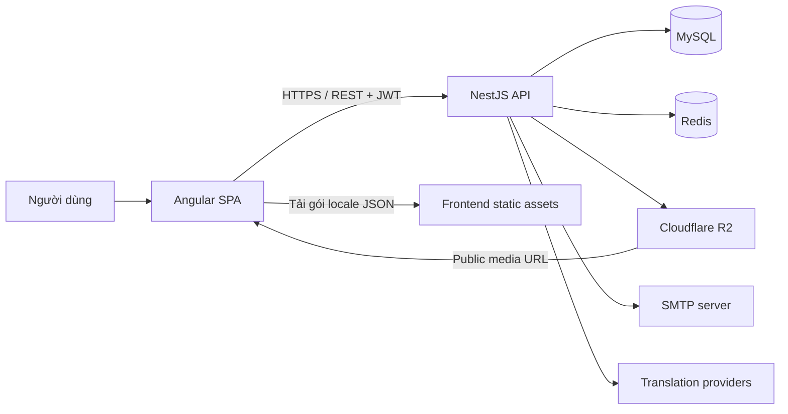
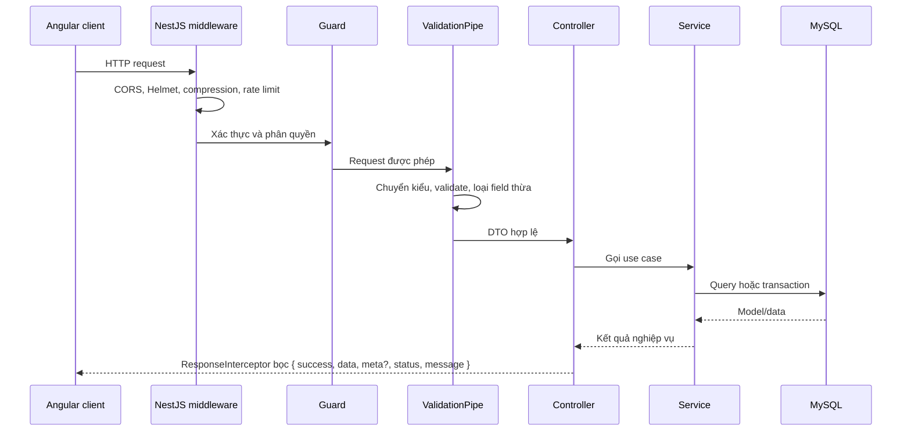
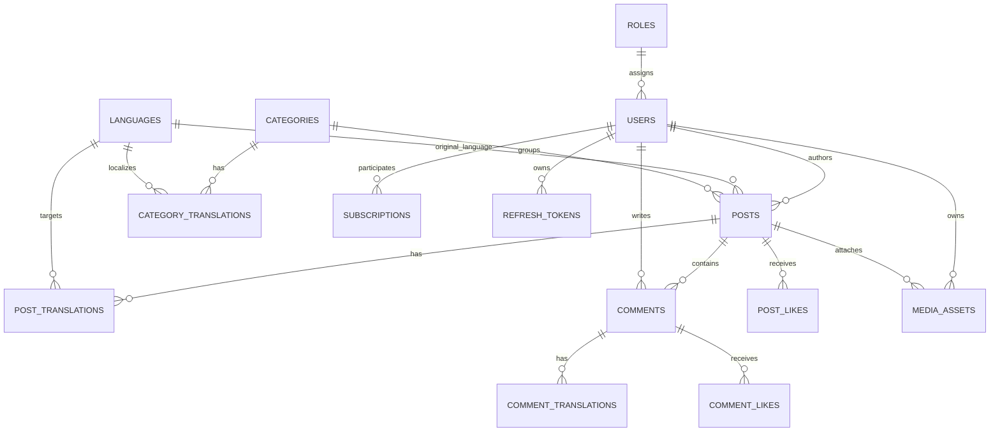
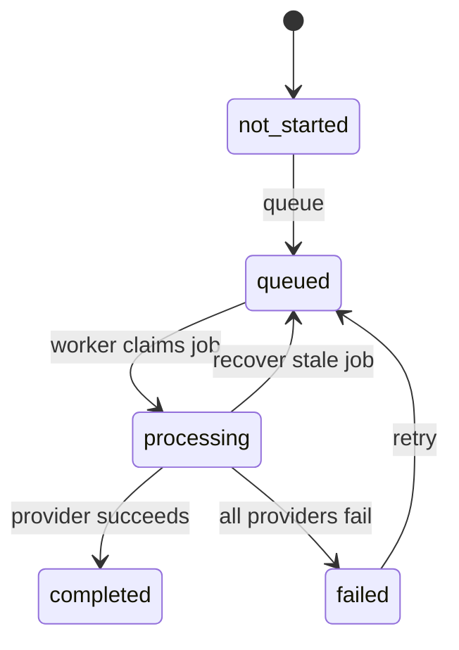
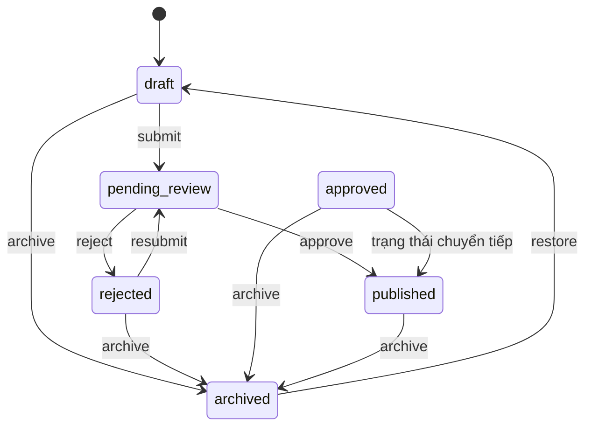

# Thiết kế kiến trúc Lingora

## 1. Mục tiêu kiến trúc

Lingora được thiết kế như một ứng dụng web đa ngôn ngữ có ba nhóm người dùng: độc giả, tác giả và quản trị viên. Kiến trúc ưu tiên các mục tiêu sau:

- Tách biệt rõ giao diện, API và dữ liệu.
- Tổ chức backend theo miền nghiệp vụ để dễ mở rộng và kiểm thử.
- Bảo vệ mọi thao tác thay đổi dữ liệu bằng xác thực và kiểm tra quyền ở backend.
- Quản lý độc lập ngôn ngữ giao diện, bản dịch danh mục và bản dịch nội dung.
- Cho phép bổ sung hoặc thay đổi nhà cung cấp dịch mà không ảnh hưởng controller và luồng bài viết.
- Thay đổi schema có kiểm soát bằng migration.

## 2. Tổng quan hệ thống

Lingora sử dụng kiến trúc modular monolith gồm Angular SPA và NestJS REST API. Backend kết nối MySQL, sử dụng Redis cho cache và chống ghi nhận lượt xem trùng, lưu media trên Cloudflare R2, đồng thời tích hợp SMTP và các nhà cung cấp dịch nội dung.



Trong môi trường phát triển, frontend chạy ở cổng `4200`, backend ở cổng `3000` và API có tiền tố `/api/v1`. Trong production, frontend sử dụng URL tương đối `/api/v1`, phù hợp với mô hình reverse proxy phục vụ web và API trên cùng domain.

## 3. Phân lớp ứng dụng

### Frontend

Frontend sử dụng Angular standalone components và lazy loading theo route. Cấu trúc chính:

```text
frontend/src/app/
├─ core/          # Auth, HTTP interceptor, locale, theme, preferences
├─ shared/        # Component, directive, pipe và layout dùng chung
├─ features/      # Chức năng theo miền: posts, users, admin, search...
├─ layouts/       # Main layout và admin layout
├─ app.config.ts  # Router, HttpClient và interceptor toàn cục
└─ app.routes.ts  # Route công khai, route xác thực và route admin
```

Các feature gọi API qua service riêng và ánh xạ phản hồi sang model TypeScript. `authInterceptor` tự gắn access token, thử refresh phiên khi nhận `401` và mở hộp thoại đăng nhập nếu không thể khôi phục phiên. `errorInterceptor` xử lý lỗi HTTP ở cấp ứng dụng.

Route được bảo vệ ở giao diện bằng `authGuard` và `adminGuard`. Đây chỉ là lớp bảo vệ trải nghiệm; quyền thực sự luôn được kiểm tra lại ở backend.

### Backend

Backend dùng mô hình NestJS module, controller và service:

```text
backend/src/
├─ common/        # Decorator, guard, exception filter, response interceptor
├─ database/      # Kết nối Sequelize, model registry, migration, seeder
├─ modules/       # Các module nghiệp vụ
├─ utils/         # Tiện ích thuần dùng chung
├─ app.module.ts  # Composition root
└─ main.ts        # Khởi tạo HTTP server và middleware toàn cục
```

Mỗi module sở hữu route và logic của một miền. Controller nhận HTTP input, DTO chịu trách nhiệm validation, service thực thi quy tắc nghiệp vụ và model Sequelize truy cập MySQL. Các module chỉ export service khi miền khác thực sự cần dùng.

### Dữ liệu

Sequelize được cấu hình với `synchronize: false`. Schema được quản lý bằng các migration trong `backend/src/database/migrations`; seeder cung cấp vai trò, ngôn ngữ và dữ liệu phát triển. `backend/database-schema.dbml` là sơ đồ tham khảo, còn migration là nguồn sự thật khi triển khai database.

## 4. Các module nghiệp vụ

| Module | Trách nhiệm |
|---|---|
| `auth` | Đăng ký, đăng nhập, refresh token, đăng xuất, đổi/đặt lại mật khẩu và hồ sơ hiện tại |
| `users` | Hồ sơ công khai, người dùng đề xuất và quản trị tài khoản |
| `languages` | Ngôn ngữ hoạt động, ngôn ngữ mặc định và tỷ lệ hoàn thành bản dịch |
| `categories` | Danh mục và tên/slug theo từng ngôn ngữ |
| `posts` | Feed công khai, workspace tác giả và kiểm duyệt quản trị |
| `translations` | Ma trận bản dịch, preview, hàng đợi, worker và provider fallback |
| `comments` | Bình luận phân cấp và bản dịch bình luận |
| `likes` | Bật/tắt lượt thích bài viết và bình luận |
| `subscriptions` | Quan hệ theo dõi và feed theo tác giả |
| `search` | Tìm kiếm tổng hợp |
| `uploads` | Kiểm tra và lưu media của trình soạn thảo |
| `dashboard` | Chỉ số tổng quan cho quản trị viên |
| `mail` | Gửi email, hiện được dùng trong luồng khôi phục mật khẩu |

`AppModule` là composition root, đăng ký cấu hình, cache, rate limit, database và toàn bộ module nghiệp vụ. Rate limit toàn cục mặc định là 60 request trong một phút.

## 5. Luồng xử lý HTTP



Nếu phát sinh exception, `GlobalExceptionFilter` chuyển lỗi về một error envelope thống nhất. Lỗi validation, xác thực, quyền, không tìm thấy và xung đột nghiệp vụ vì vậy có cùng cấu trúc ở frontend.

## 6. Mô hình dữ liệu

Các thực thể lõi và quan hệ chính:



Các ràng buộc quan trọng của mô hình:

- Bài viết giữ `original_language_id`; mỗi ngôn ngữ đích có một `post_translations` riêng.
- Danh mục tách bản ghi gốc và `category_translations` để quản lý tên/slug theo ngôn ngữ.
- Bình luận hỗ trợ cây trả lời qua `parent_id` và lưu ngôn ngữ gốc để dịch khi cần.
- Lượt thích bài, lượt thích bình luận và subscription là các bảng nối có ràng buộc duy nhất để tránh tương tác trùng.
- Refresh token được lưu riêng theo người dùng để có thể thu hồi một phiên hoặc toàn bộ phiên.
- `media_assets` theo dõi object R2 theo chủ sở hữu, mục đích, bài viết và trạng thái `temporary`/`attached`/`deleted`.
- Bài viết và một số nội dung dùng soft delete; truy vấn công khai phải loại các bản ghi đã xóa.

## 7. Xác thực và bảo mật

### Vòng đời phiên

1. Người dùng đăng nhập bằng email hoặc username và mật khẩu.
2. Backend trả access token ngắn hạn trong JSON và đặt refresh token dài hạn trong cookie `HttpOnly`, `Secure`, `SameSite=Lax`.
3. Frontend giữ access token trong bộ nhớ Angular và gắn nó vào request cần xác thực.
4. Khi tải lại trang hoặc access token hết hạn, frontend gọi `/auth/refresh`; trình duyệt tự gửi cookie, backend xoay refresh token rồi frontend thử lại request ban đầu.
5. Logout thu hồi refresh token hiện tại và xóa cookie; logout-all thu hồi mọi refresh token của người dùng.

Mật khẩu được băm bằng bcrypt. JWT strategy không chỉ kiểm tra chữ ký và thời hạn mà còn tải lại người dùng, từ chối tài khoản không tồn tại hoặc không ở trạng thái `active`.

### Phân quyền

- `JwtAuthGuard` bảo vệ endpoint yêu cầu đăng nhập.
- `OptionalJwtAuthGuard` bổ sung danh tính nếu token hợp lệ nhưng vẫn cho phép khách truy cập.
- `RolesGuard` và decorator `@Roles('admin')` bảo vệ chức năng quản trị.
- Service tiếp tục kiểm tra ownership cho bài viết, bản dịch, bình luận và các thao tác cá nhân.

### Bảo vệ HTTP và dữ liệu

- Helmet thiết lập security headers; compression giảm kích thước phản hồi.
- CORS chỉ chấp nhận các origin trong `FRONTEND_URL` và cho phép credentials.
- Validation pipe bật `whitelist` và `transform` cho toàn bộ API.
- Upload được kiểm tra MIME type, kích thước và đặt tên sinh tự động trước khi lưu.
- Nội dung HTML do người dùng nhập được làm sạch tại tầng nghiệp vụ trước khi lưu hoặc hiển thị.
- Secret và khóa provider chỉ lấy từ biến môi trường, không nằm trong mã nguồn.

## 8. Kiến trúc đa ngôn ngữ

Lingora tách ba loại dữ liệu ngôn ngữ để mỗi loại có vòng đời phù hợp.

### Giao diện

Chuỗi giao diện nằm trong `frontend/public/locales/{code}.json`. `LocaleService` lấy danh sách ngôn ngữ hoạt động từ `/languages`, tải gói JSON tương ứng và lưu lựa chọn trong browser storage. Nếu lựa chọn cũ không còn hợp lệ, frontend dùng ngôn ngữ mặc định hoặc ngôn ngữ đầu tiên đang hoạt động.

Gói locale là static asset của frontend; backend không tạo hoặc tự dịch các file này. Một ngôn ngữ chỉ nên được bật cho giao diện sau khi gói JSON tương ứng đã được triển khai.

### Danh mục

Danh mục có bảng dịch riêng. Quản trị viên gửi đúng một bản nguồn; backend dịch tên sang các ngôn ngữ đang hoạt động bằng chuỗi provider và sinh slug tương ứng trong transaction. Khi cập nhật, ngôn ngữ được gửi là nguồn mới và các bản dịch còn lại được đồng bộ lại. Danh mục hệ thống `uncategorized` được migration đảm bảo tồn tại và không thể xóa như danh mục thường.

### Bài viết và bình luận

Nội dung gốc và bản dịch được lưu riêng. Bài viết có danh sách ngôn ngữ đích và trạng thái dịch độc lập; bình luận có thể được dịch theo yêu cầu. Translation provider xử lý nội dung bài viết, bình luận và bản dịch danh mục; không xử lý gói locale giao diện tĩnh.

## 9. Worker dịch nội dung

`TranslationsService` vừa cung cấp use case đồng bộ như preview, vừa quản lý worker polling trong tiến trình backend.



Luồng xử lý:

1. Tác giả chọn ngôn ngữ đích; service tạo hoặc cập nhật `post_translations` sang `queued` trong transaction.
2. Worker chạy theo `TRANSLATION_WORKER_INTERVAL_MS` và nhận một công việc đang chờ.
3. Provider được thử theo thứ tự `TRANSLATION_PROVIDER_ORDER`.
4. Provider đầu tiên thành công cung cấp title/content đã dịch; kết quả chuyển sang `completed`.
5. Nếu mọi provider thất bại, bản dịch chuyển sang `failed` và có thể được retry.
6. Khi backend khởi động, job `processing` quá thời gian `TRANSLATION_JOB_STALE_MS` được khôi phục để tránh kẹt vĩnh viễn.

Các adapter hiện hỗ trợ DeepL, Azure Translator, Google Cloud Translation, Google Free và LibreTranslate tùy theo biến môi trường. Timeout provider được giới hạn bởi `TRANSLATION_PROVIDER_TIMEOUT_MS`.

Worker hiện chạy trong cùng tiến trình API. Cache dùng Redis dùng chung, nhưng việc claim translation job vẫn cần được xem xét kỹ trước khi scale ngang nhiều backend instance; khi đó nên dùng cơ chế khóa phân tán hoặc queue chuyên dụng. Media đã nằm trên object storage R2 nên không phụ thuộc filesystem của container.

## 10. Vòng đời bài viết



Luồng kiểm duyệt hiện tại đưa bài được chấp thuận trực tiếp từ `pending_review` sang `published`; `approved` vẫn tồn tại để tương thích dữ liệu cũ. Tác giả được chỉnh sửa bài ở trạng thái `draft`, `pending_review` và `rejected`. Feed/search hiện chấp nhận nội dung công khai `approved` hoặc `published`, còn thống kê dashboard quản trị và số bài trong trang quản trị danh mục chỉ tính `published` chưa bị xóa mềm. Kiểm duyệt bản dịch có thể sử dụng ngôn ngữ được chọn độc lập với nội dung gốc.

## 11. Upload và lưu trữ

Upload đi vào bộ nhớ qua Multer để service kiểm tra MIME, chữ ký nội dung và kích thước rồi ghi object vào Cloudflare R2. Object key có dạng `media/{ownerId}/{uuid}.{ext}` và URL công khai được tạo từ `R2_PUBLIC_BASE_URL`.

Giới hạn hiện tại là 5 MiB cho ảnh, 25 MiB cho audio và 95 MiB cho video. Bản ghi `media_assets` quản lý ownership và vòng đời: upload mới là `temporary`, media có trong avatar/bài đã lưu chuyển sang `attached`, media bị bỏ khỏi nội dung trở lại tạm và được xóa ngay hoặc qua cleanup theo TTL. R2 nằm ngoài vòng đời container và Docker volume.

## 12. Cấu hình và triển khai

Khi chạy local, backend đọc `backend/.env`; khi chạy Docker Compose, toàn bộ service đọc `.env` ở gốc repository:

| Nhóm | Biến tiêu biểu |
|---|---|
| HTTP | `PORT`, `API_PREFIX`, `FRONTEND_URL` |
| Database | `DB_HOST`, `DB_PORT`, `DB_NAME`, `DB_USER`, `DB_PASSWORD` |
| JWT | `JWT_ACCESS_SECRET`, `JWT_REFRESH_SECRET`, TTL token |
| Email | `SMTP_HOST`, `SMTP_PORT`, `SMTP_USER`, `SMTP_PASSWORD`, `MAIL_FROM` |
| Redis | `REDIS_HOST`, `REDIS_PORT` |
| Media R2 | `R2_ENDPOINT`, `R2_ACCESS_KEY_ID`, `R2_SECRET_ACCESS_KEY`, `R2_BUCKET`, `R2_PUBLIC_BASE_URL`, `TEMP_MEDIA_*` |
| Translation | Provider order, worker interval, timeout và API key của từng provider |

Hồ sơ production sử dụng Docker Compose cho MySQL, Redis, migration, backend và frontend Nginx. Chỉ frontend bind vào `127.0.0.1:8080`; Nginx container phục vụ Angular và proxy `/api/` sang backend. Dịch vụ `cloudflared` trên Ubuntu ánh xạ `https://lingoraapp.id.vn` tới địa chỉ loopback này. MySQL, Redis, backend và cổng 8080 vì vậy không được công khai trực tiếp. Xem [hướng dẫn triển khai Docker](DOCKER_DEPLOYMENT.md).

## 13. Kiểm thử và khả năng bảo trì

- Backend dùng Jest cho unit test và Supertest cho end-to-end API test.
- Frontend dùng Jasmine/Karma và có một cấu hình Chrome Headless cho CI.
- Service nghiệp vụ được kiểm thử với dependency giả lập; guard, interceptor và các use case quan trọng có spec riêng.
- TypeScript strictness và DTO validation tạo ranh giới kiểu dữ liệu ở cả client lẫn server.

Mỗi miền nghiệp vụ mới phải được tổ chức thành module riêng, giữ controller mỏng, đặt quy tắc nghiệp vụ trong service, khai báo DTO cho toàn bộ input và bổ sung migration khi schema thay đổi. Mọi thay đổi endpoint phải được cập nhật đồng thời trong [tài liệu API](API.md).
