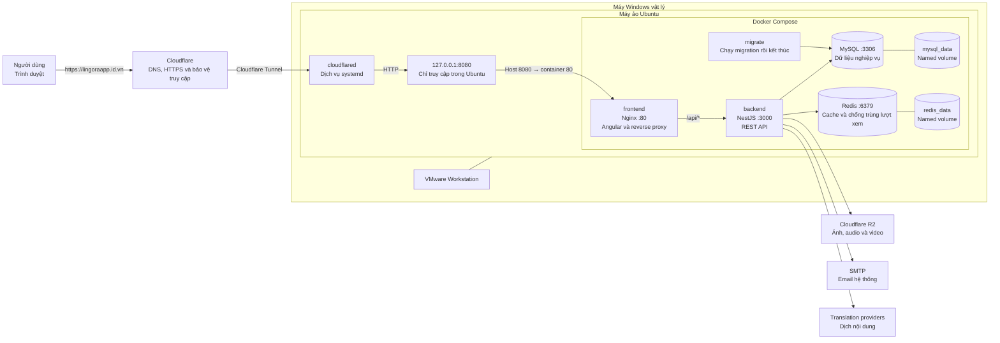

# Hướng dẫn triển khai Lingora bằng Docker

Tài liệu này là runbook cài đặt, vận hành và cập nhật Lingora trên Ubuntu bằng Docker Compose và Cloudflare Tunnel. Cấu hình được mô tả tương ứng với `docker-compose.yml`, `.env.example` và hồ sơ production của repository.

## 1. Phạm vi và mô hình triển khai

Hồ sơ triển khai production hiện hành sử dụng tên miền `lingoraapp.id.vn` và có luồng truy cập như sau:



Sơ đồ phân tách ba phạm vi vận hành: máy vật lý Windows, máy ảo Ubuntu và mạng nội bộ Docker Compose. `cloudflared` chạy dưới systemd trên Ubuntu, độc lập với các container. Chỉ container `frontend` được ánh xạ tới địa chỉ loopback của Ubuntu; `backend`, MySQL và Redis không công khai cổng ra Internet.

Luồng tương đương ở dạng văn bản:

```text
Người dùng
  -> https://lingoraapp.id.vn
  -> Cloudflare DNS/HTTPS
  -> Cloudflare Tunnel
  -> dịch vụ cloudflared trên Ubuntu
  -> http://127.0.0.1:8080
  -> cổng 80 của container frontend (Nginx)
       |-- /      -> Angular SPA
       `-- /api/* -> backend:3000/api/*
                         |-- mysql:3306
                         |-- redis:6379
                         `-- Cloudflare R2
```

Các service trong `docker-compose.yml`:

| Service      | Vai trò                                          | Cổng công khai                          |
| ------------ | ------------------------------------------------- | ----------------------------------------- |
| `mysql`    | MySQL 8, lưu dữ liệu nghiệp vụ               | Không                                    |
| `redis`    | Redis 7, cache và chống tính lượt xem trùng | Không                                    |
| `migrate`  | Chạy Sequelize migration trước backend         | Không                                    |
| `backend`  | NestJS API tại cổng nội bộ `3000`           | Không                                    |
| `frontend` | Nginx phục vụ Angular và proxy `/api/`       | Chỉ bind `127.0.0.1:8080` trên Ubuntu |

MySQL và Redis sử dụng named volume `mysql_data` và `redis_data`. Lệnh `docker compose down` giữ lại các volume này; tùy chọn `-v` sẽ xóa volume và không được sử dụng trong quy trình dừng dịch vụ thông thường.

`cloudflared` chạy trực tiếp trên Ubuntu dưới dạng dịch vụ systemd, không nằm trong Compose. Vì tunnel tạo kết nối đi ra Cloudflare, mô hình hiện tại không cần port-forward router và không cần mở cổng inbound `80`, `443` hoặc `8080`.

## 2. Yêu cầu hệ thống

- Máy Windows, VMware và máy ảo Ubuntu phải đang chạy.
- Ubuntu có kết nối Internet.
- Docker Engine, Docker Compose plugin và dịch vụ `cloudflared` đang hoạt động.
- Tên miền sử dụng nameserver Cloudflare; public hostname `lingoraapp.id.vn` của tunnel trỏ tới `http://127.0.0.1:8080`.
- Cloudflare R2, SMTP và ít nhất một phương án dịch được cấu hình đúng trong `.env`.

Cấu hình khuyến nghị cho máy ảo: tối thiểu 2 CPU, 2 GB RAM và 40 GB đĩa; 4 GB RAM trở lên giúp build image ổn định hơn.

## 3. Cài đặt Docker trên Ubuntu

Dùng repository APT chính thức của Docker:

```bash
sudo apt update
sudo apt install -y ca-certificates curl
sudo install -m 0755 -d /etc/apt/keyrings
sudo curl -fsSL https://download.docker.com/linux/ubuntu/gpg \
  -o /etc/apt/keyrings/docker.asc
sudo chmod a+r /etc/apt/keyrings/docker.asc

sudo tee /etc/apt/sources.list.d/docker.sources >/dev/null <<EOF
Types: deb
URIs: https://download.docker.com/linux/ubuntu
Suites: $(. /etc/os-release && echo "${UBUNTU_CODENAME:-$VERSION_CODENAME}")
Components: stable
Architectures: $(dpkg --print-architecture)
Signed-By: /etc/apt/keyrings/docker.asc
EOF

sudo apt update
sudo apt install -y docker-ce docker-ce-cli containerd.io \
  docker-buildx-plugin docker-compose-plugin
sudo systemctl enable --now docker
sudo docker version
sudo docker compose version
```

Tài liệu chính thức: [Docker Engine trên Ubuntu](https://docs.docker.com/engine/install/ubuntu/) và [Docker Compose plugin](https://docs.docker.com/compose/install/linux/).

Các lệnh trong tài liệu giả định tài khoản triển khai có quyền thực thi Docker. Có thể sử dụng `sudo` hoặc thêm tài khoản vào nhóm `docker`; cần lưu ý rằng thành viên nhóm `docker` có quyền gần tương đương `root`.

## 4. Chuẩn bị mã nguồn

Nhánh triển khai mặc định là `develop`:

```bash
sudo mkdir -p /opt/lingora
sudo chown "$USER":"$USER" /opt/lingora
git clone --branch develop --single-branch \
  https://github.com/NgocThinh2004/Lingora.git /opt/lingora
cd /opt/lingora
git branch --show-current
```

Lệnh `git branch --show-current` phải trả về `develop`. Chỉ triển khai commit đã được đẩy lên remote và hợp nhất vào nhánh triển khai.

## 5. Cấu hình môi trường production

Compose đọc file `.env` ở thư mục gốc; `backend/.env` chỉ dùng khi chạy backend local ngoài Docker.

```bash
cd /opt/lingora
cp .env.example .env
chmod 600 .env
nano .env
```

Các giá trị quan trọng:

| Nhóm                                         | Yêu cầu                                                                |
| --------------------------------------------- | ------------------------------------------------------------------------ |
| `FRONTEND_URL`                              | `https://lingoraapp.id.vn`                                             |
| `MYSQL_ROOT_PASSWORD`                       | Tạo mới cho MySQL production; không cần giống local                 |
| `DB_USER`, `DB_PASSWORD`                  | Tài khoản ứng dụng production, khác tài khoản root                |
| `JWT_ACCESS_SECRET`, `JWT_REFRESH_SECRET` | Hai chuỗi dài, ngẫu nhiên và khác nhau                             |
| `SMTP_*`, `MAIL_FROM`                     | Tài khoản gửi mail thật; Gmail dùng App Password                    |
| `R2_*`                                      | Endpoint, API token, bucket và public base URL của R2                  |
| `TRANSLATION_*`                             | Thứ tự provider, worker và giới hạn xử lý                         |
| API key dịch                                 | Cần ít nhất provider hoạt động hoặc bật fallback `google-free` |

Giữ các hostname nội bộ sau khi chạy Compose:

```dotenv
NODE_ENV=production
PORT=3000
API_PREFIX=api/v1
FRONTEND_URL=https://lingoraapp.id.vn
DB_HOST=mysql
DB_PORT=3306
REDIS_HOST=redis
REDIS_PORT=6379
```

Secret có thể được tạo bằng `openssl rand -hex 48`. File `.env`, nội dung bí mật và token Cloudflare Tunnel không được commit, ghi vào log hoặc xuất hiện trong tài liệu và ảnh chụp màn hình.

Kiểm tra cú pháp Compose mà không in secret:

```bash
docker compose --project-name lingora config --quiet
```

## 6. Build và khởi động ứng dụng

```bash
cd /opt/lingora
docker compose --project-name lingora up -d --build
docker compose --project-name lingora ps -a
```

Thứ tự tự động:

1. MySQL và Redis đạt healthcheck.
2. `migrate` chạy migration và kết thúc `Exited (0)`.
3. Backend khởi động và đạt healthcheck.
4. Frontend khởi động và bind `127.0.0.1:8080`.

Kiểm tra trên Ubuntu:

```bash
curl -I http://127.0.0.1:8080/
curl -fsS http://127.0.0.1:8080/api/v1/languages
docker compose --project-name lingora logs --tail=200 migrate backend frontend
```

Frontend, backend, MySQL và Redis phải có trạng thái `Up` hoặc `healthy`. Trạng thái `Exited (0)` của service `migrate` biểu thị migration đã hoàn tất thành công.

Seeder chỉ được chạy trong production sau khi đã đánh giá toàn bộ dữ liệu sẽ được tạo. Danh mục hệ thống mặc định được khởi tạo bằng migration và không phụ thuộc vào seeder thủ công.

## 7. Healthcheck và thứ tự khởi động

Healthcheck là phép kiểm tra định kỳ do Docker thực thi bên trong từng container để xác định service có thực sự sẵn sàng phục vụ hay không. Trạng thái container đang chạy không đồng nghĩa với ứng dụng bên trong đã sẵn sàng; vì vậy Compose sử dụng healthcheck kết hợp `depends_on` để kiểm soát thứ tự khởi động.

### 7.1. Cấu hình healthcheck

Các healthcheck được khai báo trong `docker-compose.yml`:

| Service | Phép kiểm tra | Chu kỳ | Timeout | Số lần thử | Thời gian khởi động |
|---|---|---:|---:|---:|---:|
| `mysql` | `mysqladmin ping` tới MySQL trong container | 10 giây | 5 giây | 10 | 30 giây |
| `redis` | `redis-cli ping` và yêu cầu phản hồi `PONG` | 10 giây | 5 giây | 5 | Không cấu hình |
| `backend` | Gọi `GET http://127.0.0.1:3000/api/v1/languages` và yêu cầu HTTP thành công | 15 giây | 5 giây | 10 | 30 giây |
| `frontend` | Dùng `wget` kiểm tra Nginx tại `http://127.0.0.1/` | 15 giây | 5 giây | 5 | Không cấu hình |
| `migrate` | Không dùng healthcheck; thành công khi tiến trình kết thúc với exit code `0` | — | — | — | — |

Ý nghĩa các thuộc tính:

| Thuộc tính | Ý nghĩa |
|---|---|
| `test` | Lệnh hoặc chương trình được thực thi để kiểm tra service |
| `interval` | Khoảng thời gian giữa hai lần kiểm tra |
| `timeout` | Thời gian tối đa cho một lần kiểm tra |
| `retries` | Số lần thất bại liên tiếp trước khi container chuyển sang `unhealthy` |
| `start_period` | Khoảng thời gian khởi động được miễn tính lỗi, phù hợp với service cần thời gian khởi tạo |

Docker ghi nhận ba trạng thái healthcheck:

- `starting`: container đang trong giai đoạn khởi động hoặc chưa có kết quả kiểm tra ổn định.
- `healthy`: lần kiểm tra gần nhất thành công.
- `unhealthy`: số lần kiểm tra thất bại liên tiếp đã đạt ngưỡng `retries`.

Trạng thái `unhealthy` không tự động khởi động lại container nếu tiến trình chính vẫn chạy. Cần kiểm tra log và nguyên nhân gốc thay vì chỉ restart container.

### 7.2. Quan hệ phụ thuộc giữa các service

Compose sử dụng các điều kiện sau:

```text
mysql healthy ──> migrate completed successfully ──> backend healthy ──> frontend
redis healthy ─────────────────────────────────────> backend
```

- `migrate` chỉ chạy sau khi MySQL đạt `healthy`.
- `backend` chỉ khởi động sau khi migration kết thúc thành công và Redis đạt `healthy`.
- `frontend` chỉ khởi động sau khi backend đạt `healthy`.
- Nếu migration kết thúc với exit code khác `0`, backend và frontend không được khởi động theo chuỗi phụ thuộc.

`depends_on` chỉ kiểm soát điều kiện khởi động trong Compose. Cơ chế này không thay thế retry, timeout và xử lý mất kết nối trong chính ứng dụng khi một dependency gặp sự cố sau thời điểm khởi động.

### 7.3. Kiểm tra trạng thái

Xem trạng thái tổng quan:

```bash
cd /opt/lingora
docker compose --project-name lingora ps -a
```

Kết quả hợp lệ sau khi hệ thống ổn định:

| Service | Trạng thái yêu cầu |
|---|---|
| `mysql` | `Up ... (healthy)` |
| `redis` | `Up ... (healthy)` |
| `migrate` | `Exited (0)` |
| `backend` | `Up ... (healthy)` |
| `frontend` | `Up ... (healthy)` |

Xem chi tiết healthcheck và các lần kiểm tra gần nhất:

```bash
docker inspect --format '{{json .State.Health}}' lingora-mysql
docker inspect --format '{{json .State.Health}}' lingora-redis
docker inspect --format '{{json .State.Health}}' lingora-backend
docker inspect --format '{{json .State.Health}}' lingora-frontend
```

Khi có `jq`, kết quả có thể được định dạng dễ đọc hơn:

```bash
docker inspect --format '{{json .State.Health}}' lingora-backend | jq
```

Kiểm tra toàn bộ đường dẫn phục vụ trong Ubuntu:

```bash
curl -fI http://127.0.0.1:8080/
curl -fsS http://127.0.0.1:8080/api/v1/languages
```

### 7.4. Xử lý trạng thái `unhealthy`

Thực hiện chẩn đoán theo service thay vì khởi động lại toàn bộ stack:

```bash
docker compose --project-name lingora logs --tail=200 mysql
docker compose --project-name lingora logs --tail=200 redis
docker compose --project-name lingora logs --tail=200 migrate
docker compose --project-name lingora logs --tail=200 backend
docker compose --project-name lingora logs --tail=200 frontend
```

| Service lỗi | Nội dung cần kiểm tra |
|---|---|
| `mysql` | Mật khẩu trong `.env`, dung lượng đĩa, quyền của volume và log khởi tạo MySQL |
| `redis` | Tiến trình Redis, volume `redis_data` và khả năng trả lời `PING` |
| `migrate` | Kết nối database, thứ tự migration và lỗi schema; trạng thái này được xác định bằng exit code thay vì healthcheck |
| `backend` | Kết nối MySQL/Redis, biến môi trường, log NestJS và phản hồi của `/api/v1/languages` |
| `frontend` | Cấu hình Nginx, file build Angular và khả năng kết nối backend qua mạng Compose |

Sau khi nguyên nhân đã được xử lý, tạo lại service bị ảnh hưởng rồi yêu cầu Compose đánh giá lại toàn bộ chuỗi phụ thuộc:

```bash
docker compose --project-name lingora up -d --force-recreate <service-name>
docker compose --project-name lingora up -d
docker compose --project-name lingora ps -a
```

`<service-name>` phải được thay bằng một service trong `docker-compose.yml`, ví dụ `redis`, `backend` hoặc `frontend`. Không dùng `--force-recreate` cho MySQL trước khi đã xác minh volume và có backup phù hợp.

### 7.5. Phạm vi của healthcheck

Healthcheck Docker xác nhận tình trạng service trong phạm vi máy chủ, nhưng không xác nhận toàn bộ đường truy cập từ Internet. Hệ thống vẫn có thể mất truy cập công khai khi container đều `healthy` nhưng DNS, Cloudflare Tunnel hoặc kết nối mạng gặp sự cố.

Việc giám sát production cần bao gồm cả hai lớp:

1. **Nội bộ:** trạng thái healthcheck của MySQL, Redis, backend và frontend.
2. **Bên ngoài:** yêu cầu HTTPS định kỳ tới `https://lingoraapp.id.vn/` và một endpoint API công khai.

Healthcheck hiện tại của backend sử dụng `/api/v1/languages`, do đó kiểm tra được tiến trình HTTP và một phần khả năng truy cập dữ liệu. Đây chưa phải endpoint readiness chuyên dụng; nếu endpoint này thay đổi nghiệp vụ hoặc trở nên tốn kém, cần bổ sung endpoint như `/health/live` và `/health/ready`.

## 8. Cấu hình Cloudflare Tunnel

Tạo tunnel loại `cloudflared` trong Cloudflare Zero Trust, chọn môi trường Debian/Ubuntu và thực thi lệnh cài đặt do Dashboard cung cấp trên máy chủ Ubuntu. Connector được đăng ký thành dịch vụ systemd bằng token của tunnel:

```bash
sudo cloudflared service install <TUNNEL_TOKEN>
```

Token tunnel là thông tin bí mật. Khi có dấu hiệu lộ token, cần xoay token trên Cloudflare và đăng ký lại connector.

Trong cấu hình tunnel, tạo public hostname:

| Trường     | Giá trị                 |
| ------------ | ------------------------- |
| Hostname     | `lingoraapp.id.vn`      |
| Service type | `HTTP`                  |
| URL          | `http://127.0.0.1:8080` |

Kiểm tra dịch vụ:

```bash
sudo systemctl enable --now cloudflared
sudo systemctl status cloudflared --no-pager
sudo journalctl -u cloudflared -n 100 --no-pager
```

Xác minh truy cập công khai từ một mạng độc lập:

```text
https://lingoraapp.id.vn
https://lingoraapp.id.vn/api/v1/languages
```

Không tạo thêm bản ghi `A` trỏ tới IP cũ của nhà cung cấp domain cho cùng hostname khi hostname đã do Tunnel quản lý.

Tài liệu chính thức: [tạo remotely-managed tunnel](https://developers.cloudflare.com/cloudflare-one/networks/connectors/cloudflare-tunnel/get-started/create-remote-tunnel/) và [yêu cầu firewall của Tunnel](https://developers.cloudflare.com/cloudflare-one/networks/connectors/cloudflare-tunnel/configure-tunnels/tunnel-with-firewall/).

## 9. Vận hành dịch vụ

Docker và `cloudflared` được cấu hình khởi động cùng Ubuntu. Sau mỗi lần khởi động máy chủ, trạng thái dịch vụ được xác minh bằng các lệnh sau:

```bash
systemctl is-active docker
systemctl is-active cloudflared
cd /opt/lingora
docker compose --project-name lingora ps
curl -I http://127.0.0.1:8080/
```

Nếu container chưa chạy:

```bash
cd /opt/lingora
docker compose --project-name lingora up -d
```

`docker compose down` chỉ dừng các container ứng dụng và không dừng dịch vụ `cloudflared`. Lệnh `sudo shutdown now` tắt Ubuntu; website sẽ mất kết nối đến khi máy ảo được khởi động lại.

## 10. Cập nhật phiên bản từ nhánh `develop`

Tạo backup database trước mọi bản phát hành có migration, sau đó thực hiện:

```bash
cd /opt/lingora
git status --short
git switch develop
git pull --ff-only origin develop
docker compose --project-name lingora up -d --build
docker compose --project-name lingora ps -a
docker compose --project-name lingora logs --tail=200 migrate backend frontend
curl -fsS http://127.0.0.1:8080/api/v1/languages
systemctl is-active cloudflared
```

Không cần `docker compose down` trước mỗi lần cập nhật và không cần tạo lại DNS/Tunnel. `up -d --build` tạo lại service cần thiết, giữ named volumes và giảm thời gian gián đoạn.

Nếu `git status --short` hiển thị thay đổi cục bộ, quy trình cập nhật phải dừng lại cho đến khi các thay đổi được xác định và sao lưu.

## 11. Tải media lên Cloudflare R2

File đi qua Cloudflare Tunnel, Nginx frontend và NestJS trước khi backend ghi object vào R2. Các giới hạn hiện tại:

| Loại | Giới hạn backend |
| ----- | ------------------ |
| Ảnh  | 5 MiB              |
| Audio | 25 MiB             |
| Video | 95 MiB             |

Nginx container sử dụng `client_max_body_size 100m` và timeout 300 giây. Giới hạn video 95 MiB tạo khoảng an toàn dưới giới hạn request 100 MB của gói Cloudflare Free. Sự cố chỉ xuất hiện ở production cần được đối chiếu theo thứ tự: kích thước file, MIME thực tế, log frontend, log backend và trạng thái tunnel.

Media mới là `temporary`; khi avatar/bài viết được lưu nó chuyển thành `attached`. Media tạm quá hạn `TEMP_MEDIA_TTL_HOURS` sẽ được dọn khỏi R2. Xóa hoặc thay avatar/bài viết cũng đồng bộ trạng thái trong `media_assets` và xóa object phù hợp.

## 12. Backup MySQL

```bash
sudo install -d -m 700 /var/backups/lingora
set -o pipefail
docker exec lingora-mysql sh -c \
  'exec mysqldump --single-transaction --routines --triggers --no-tablespaces \
  -u"$MYSQL_USER" -p"$MYSQL_PASSWORD" "$MYSQL_DATABASE"' \
  | sudo tee /var/backups/lingora/lingora-$(date +%F-%H%M%S).sql >/dev/null
sudo find /var/backups/lingora -type f -name '*.sql' -size +0 -ls
```

Backup cần được mã hóa và sao chép sang hệ thống lưu trữ độc lập. R2 nằm ngoài Docker và cần chính sách versioning hoặc backup riêng khi có yêu cầu phục hồi media.

Khôi phục là thao tác ghi đè dữ liệu và chỉ được thực hiện sau khi xác minh file backup trong cửa sổ bảo trì đã công bố.

Ví dụ khôi phục sau khi đã kiểm tra chính xác tên file:

```bash
cd /opt/lingora
docker compose --project-name lingora stop frontend backend
docker exec -i lingora-mysql sh -c \
  'exec mysql -u"$MYSQL_USER" -p"$MYSQL_PASSWORD" "$MYSQL_DATABASE"' \
  < /var/backups/lingora/<backup-file>.sql
docker compose --project-name lingora up -d
```

### Khôi phục phiên bản mã nguồn

Migration có thể không tương thích ngược. Rollback an toàn cần cả commit cũ và backup database được tạo trước lần cập nhật:

```bash
cd /opt/lingora
git log --oneline -n 10
git switch --detach <commit-on-dinh>
docker compose --project-name lingora up -d --build
```

Khi migration mới tạo ra schema không tương thích với phiên bản cũ, database phải được khôi phục từ backup; không sử dụng `db:migrate:undo` nếu chưa xác minh khả năng đảo ngược của migration. Sau khi hoàn tất khôi phục, repository phải được chuyển lại nhánh `develop` trước lần cập nhật tiếp theo.

## 13. Chẩn đoán sự cố

```bash
cd /opt/lingora
docker compose --project-name lingora ps -a
docker compose --project-name lingora logs --tail=200 migrate
docker compose --project-name lingora logs --tail=200 backend
docker compose --project-name lingora logs --tail=200 frontend
sudo systemctl status cloudflared --no-pager
sudo journalctl -u cloudflared -n 100 --no-pager
```

| Triệu chứng                                           | Phạm vi kiểm tra                                                                               |
| ------------------------------------------------------- | ------------------------------------------------------------------------------------------------ |
| `127.0.0.1:8080` không phản hồi                    | Docker, Nginx frontend và backend                                                               |
| Địa chỉ loopback hoạt động nhưng tên miền lỗi | Dịch vụ `cloudflared`, tunnel route và DNS Cloudflare                                       |
| API phát sinh lỗi CORS hoặc cookie                   | `FRONTEND_URL=https://lingoraapp.id.vn` và thuộc tính cookie production                     |
| MySQL hoặc migration lỗi                              | `.env`, log `mysql`, log `migrate`; không bỏ qua migration để ép backend khởi động |
| Website mất kết nối khi máy vật lý tắt           | Máy Windows và Ubuntu phải hoạt động liên tục trong mô hình self-host trên VMware     |

## 14. Biến thể triển khai trên VPS

Nếu chuyển sang VPS, có hai lựa chọn:

1. **Giữ Cloudflare Tunnel:** cài Docker và `cloudflared` trên VPS, vẫn chuyển vào `127.0.0.1:8080`. Không cần mở inbound 80/443 cho ứng dụng.
2. **Không dùng Tunnel:** trỏ bản ghi `A` tới public IP VPS, cài Nginx trên host để nghe 80/443, proxy tới `127.0.0.1:8080` và cấp TLS. Khi đó phải cấu hình firewall, TLS và hardening VPS. Không áp dụng đồng thời cấu hình này với public hostname Tunnel cho cùng hostname.

## 15. Trạng thái pipeline Jenkins

`Jenkinsfile` sao chép `/var/lib/jenkins/.env` vào workspace rồi chạy `docker compose down` và `up --build -d`. Pipeline chưa đáp ứng tiêu chuẩn phát hành production vì gây downtime, chỉ chờ cố định 30 giây và chưa có bước backup, health check HTTP hoặc rollback.

Không sử dụng pipeline này cho production trước khi bổ sung các kiểm soát nêu trên. Cloudflare Tunnel chạy độc lập dưới systemd và không cần cài đặt lại trong mỗi lần phát hành.

## 16. Tiêu chí nghiệm thu

- [ ] `docker compose ps -a`: bốn service dài hạn healthy, `migrate` `Exited (0)`.
- [ ] `curl http://127.0.0.1:8080/api/v1/languages` thành công trên Ubuntu.
- [ ] `cloudflared` active và connector hiển thị Connected.
- [ ] Website và API truy cập được từ thiết bị khác mạng qua HTTPS.
- [ ] Đăng ký, đăng nhập, refresh cookie, email và dịch hoạt động.
- [ ] Upload/đọc/xóa media trên R2 hoạt động.
- [ ] Chỉ frontend bind `127.0.0.1:8080`; MySQL, Redis, backend không public port.
- [ ] `.env` không nằm trong Git và có quyền đọc hạn chế.
- [ ] Có backup MySQL ngoài máy Ubuntu và đã thử quy trình phục hồi.
